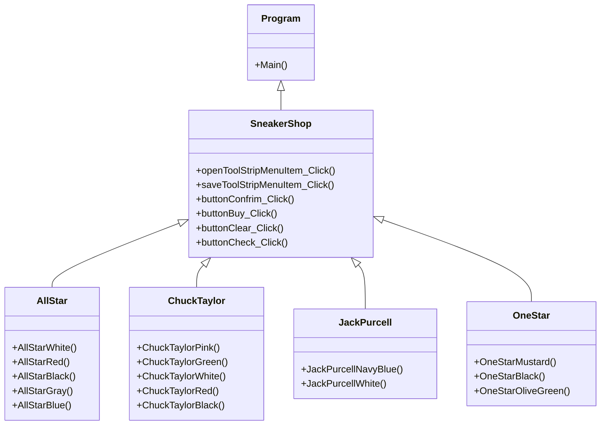

##SneakerShop By Channarong
### ความเป็นมาของโปรแกรม

  
### วัตถุประสงค์ของโปรแกรม
1.สนใจเรื่องรองเท้าConvere
2.อยากมีร้านขายรองเท้าConverseเป็นของตนเอง
3.อยากมีโปรแกรมร้านขายรองConverseเท้าเป็นของตนเอง

  
### โครงสร้างของโปรแกรม

  
### ผู้พัฒนาโปรแกรม
นายชาญณรงค์ แต่งเมือง 643450069-6
