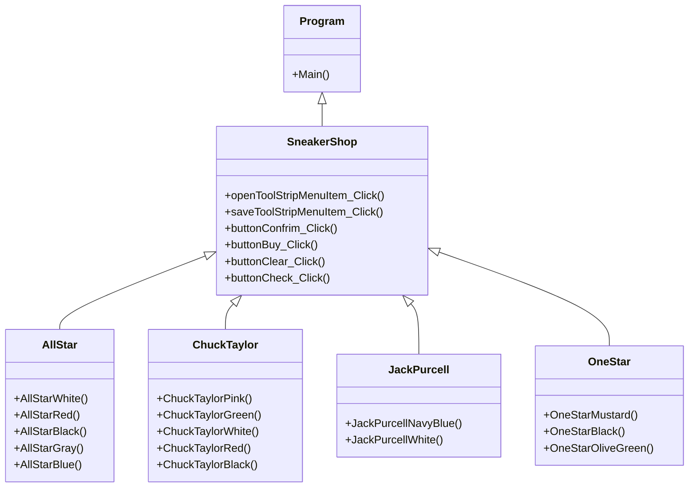

## SneakerShop By Channarong

### ความเป็นมาของโปรแกรม
1.สนใจเรื่องรองเท้าConvere 
2.อยากมีร้านขายรองเท้าConverseเป็นของตนเอง 
3.อยากศึกษาและมีโปรแกรมร้านขายรองเท้าConverseเป็นของตนเอง 

  
### วัตถุประสงค์ของโปรแกรม
1.สำหรับผู้ที่สนใจจะเลือกซื้อรองเท้าConverse  
2.เพื่อทำให้โปรแกรมการขายรองเท้ามีหลากหลายมากขึ้น 

  
### โครงสร้างของโปรแกรม

  
### ผู้พัฒนาโปรแกรม
นายชาญณรงค์ แต่งเมือง 643450069-6  
